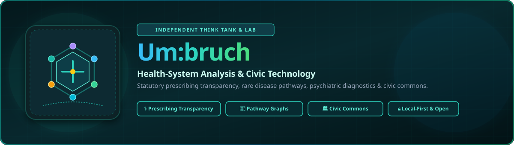
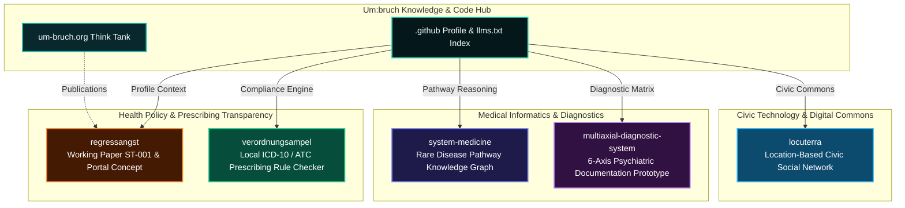

<p align="center">
  <a href="https://github.com/um-bruch"></a>
</p>

<p align="center">
  <a href="https://github.com/um-bruch/.github/blob/main/profile/README.md"></a>
  <a href="https://github.com/open-bricks"></a>
  <a href="https://um-bruch.org"></a>
  <a href="https://github.com/um-bruch"></a>
  <a href="https://github.com/um-bruch"></a>
  <a href="#research-use-boundary"></a>
  <a href="https://github.com/um-bruch"></a>
  <a href="https://github.com/um-bruch/.github/blob/main/llms.txt"></a>
  <a href="https://github.com/um-bruch/.github/blob/main/profile/README_de.md"></a>
</p>

# Um:bruch

<!-- public-index-last-checked: 2026-09-17 -->

[🇬🇧 English](README.md) | [🇩🇪 Deutsche Version](README_de.md)

**Independent think tank and lab for health-system analysis, statutory prescribing transparency, rare-disease pathway logic, and public-interest civic technology.**

Um:bruch publishes reproducible research analyses, open policy data, working papers, and practical local-first software prototypes. Our public work bridges statutory prescribing regulations in the German healthcare system (AM-RL, G-BA, PRISCUS 2.0, Praxisbesonderheiten), medical knowledge graphs for rare diseases, multiaxial psychiatric documentation models (DSM-5-TR, ICD-11, ICF), and location-based digital commons for municipalities.

> [!NOTE]
> **Public Navigation Index:** Refreshed and verified against live GitHub API metadata on **2026-09-17**. Every public repository active in `um-bruch` (5 research/civic applications plus 1 profile repository) is fully indexed and mapped here.

> [!TIP]
> **Local-First & Data-Parsimonious:** All software prototypes developed by Um:bruch operate locally on the user's machine without mandatory cloud dependencies, telemetry, or user tracking. Data privacy and reproducible open science are fundamental design invariants.

---

## Showcase

<p align="center">
  <a href="https://github.com/um-bruch/verordnungsampel"></a>
  <a href="https://github.com/um-bruch/locuterra"></a>
</p>

*Above: [VerordnungsAmpel](https://github.com/um-bruch/verordnungsampel) (local prescription budget & compliance checker) and [LOCUTERRA](https://github.com/um-bruch/locuterra) (public-interest location-based civic network demonstrator).*

---

## Start Here

| Objective / Need | Repository / Entry Point | Domain Focus & Key Capabilities |
|---|---|---|
| Explore German statutory prescribing compliance & budget rules | [verordnungsampel](https://github.com/um-bruch/verordnungsampel) | Local ICD-10-GM / ATC checks against AM-RL, G-BA, PRISCUS 2.0, and Heilmittelkatalog rule sets |
| Research German recourse anxiety (*Regressangst*) & audit risks | [regressangst](https://github.com/um-bruch/regressangst) | Working paper ST-001, healthcare transparency analysis, and the PP-003 Regress portal concept |
| Investigate rare-disease differential diagnosis & pathway exclusion | [system-medicine](https://github.com/um-bruch/system-medicine) | Medical knowledge graph, functional pathway reasoning, exclusion logic, and PySide6 workspace |
| Study 6-axis psychiatric diagnostic documentation prototypes | [multiaxial-diagnostic-system](https://github.com/um-bruch/multiaxial-diagnostic-system) | Documentation model referencing DSM-5-TR, ICD-11, ICF, HiTOP, Streamlit workspace & Flask testcenter |
| Inspect municipal location-based civic network demonstrator | [locuterra](https://github.com/um-bruch/locuterra) | Open concept, Next.js demonstrator, PWA companion, and municipal digital commons |
| Machine-readable crawler, agent & LLM context | [`llms.txt`](https://github.com/um-bruch/.github/blob/main/llms.txt) | Canonical context, preferred discovery terms, repository boundaries, and positioning |

---

## Domain Architecture & Research Pillars



---

## Public Repository Directory

Verified against the live GitHub API on **2026-09-17**: 6 public repositories in total (5 research & software repositories plus 1 central organization profile).

| Repository | Tech Stack & License | Description & Highlights | Discovery Terms | Last Public Push |
|---|---|---|---|---|
| [verordnungsampel](https://github.com/um-bruch/verordnungsampel) | Python 3.10+, PySide6, SQLite, PWA · GPL-3.0 | Local-first prescribing compliance & budget traffic-light system for statutory health insurance in Germany. Validates ICD-10-GM / ATC pairs against AM-RL, G-BA decisions, PRISCUS 2.0, and Heilmittelkatalog budgets. | `VerordnungsAmpel`, `AM-RL`, `G-BA`, `PRISCUS 2.0`, `Heilmittelkatalog`, `ICD-10-GM ATC checker`, `German prescribing rules`, `Praxisbesonderheiten` | **2026-09-13** |
| [locuterra](https://github.com/um-bruch/locuterra) | TypeScript, React, Next.js, TailwindCSS, PWA · MIT | Open-source concept and interactive Next.js demonstrator for a public-interest, location-based civic social network and digital commons for municipalities with synthetic district demo data (*Grüntal*). | `LOCUTERRA`, `civic tech`, `municipal digital commons`, `location-based social network`, `Next.js PWA`, `local community platform`, `civic engagement` | **2026-08-25** |
| [system-medicine](https://github.com/um-bruch/system-medicine) | Python 3.10+, PySide6, SQLite, NetworkX · MIT | Research-only functional pathway medical knowledge graph for rare-disease differential diagnosis research, pathway exclusion logic, and biomedical graph reasoning. Permanent DOI: [10.5281/zenodo.20101507](https://doi.org/10.5281/zenodo.20101507). | `systems medicine`, `functional pathway knowledge graph`, `rare disease differential diagnosis`, `pathway exclusion logic`, `biomedical graph reasoning` | **2026-08-21** |
| [multiaxial-diagnostic-system](https://github.com/um-bruch/multiaxial-diagnostic-system) | TeX, Python 3.10+, Streamlit, Flask, SQLite · MIT | Research-use-only 6-axis psychiatric documentation prototype referencing DSM-5-TR, ICD-11, ICF, HiTOP, Streamlit diagnostic workspace, and Flask screening testcenter. Permanent DOI: [10.5281/zenodo.18736725](https://doi.org/10.5281/zenodo.18736725). | `multiaxial diagnostic system`, `DSM-5-TR ICD-11 ICF`, `psychiatric documentation prototype`, `HiTOP dimensional diagnostics`, `Streamlit medical informatics` | **2026-08-05** |
| [regressangst](https://github.com/um-bruch/regressangst) | Markdown, LaTeX, Research Data · CC BY 4.0 | Working-paper repository for ST-001 on German statutory prescribing-audit recourse anxiety, health-care system transparency, economic disincentives, and the PP-003 Regress portal concept. | `Regressangst`, `prescribing audit recourse anxiety`, `German healthcare transparency`, `Wirtschaftlichkeitsprüfung`, `Arzneimittelregress`, `Kassenarzt` | **2026-07-27** |
| [`.github`](https://github.com/um-bruch/.github) | Markdown, GFM, YAML, `llms.txt`, pytest | Central organization profile, community health files, contract test suite, llms.txt context, and ecosystem discoverability index. | `um-bruch`, `organization profile`, `llms.txt`, `public repository directory`, `health policy think tank` | **2026-09-10** |

---

## Research-Use Boundary

> [!IMPORTANT]
> **Research & Proof-of-Concept Software Only:**
> The software repositories published by Um:bruch (`system-medicine`, `multiaxial-diagnostic-system`, `verordnungsampel`) are academic, scientific, and proof-of-concept prototypes developed for exploratory research and healthcare-policy analysis.
> 
> They do **not** constitute medical advice, clinical guidelines, diagnostic validation, or certified medical devices under the European Union Medical Device Regulation (EU MDR 2017/745) or German BfArM regulations. Any medical decision-making must rely on licensed healthcare practitioners and authorized clinical guidelines.

---

## Working Principles

| Principle | Technical & Ethical Meaning |
|---|---|
| **Reproducible & Inspectable** | All research methodology, dataset transformations, schemas, and algorithm logic are fully open for peer review and public audit. |
| **Research vs. Clinical Claims** | Software prototypes serve exploratory analysis, policy debate, and educational prototyping — never direct patient care or automated clinical decisions. |
| **Local-First & Data-Parsimonious** | Applications run locally on user hardware without mandatory cloud telemetry, third-party analytics, or vendor lock-in. |
| **Bilingual Connection** | The primary legislative and operational context is the German healthcare system, complemented by English metadata for international research visibility. |

---

## Search Phrases & Discoverability

```
Um:bruch Think Tank GitHub
Um:bruch health policy research software
Um:bruch re:shape health policy software
Umbruch Regressangst VerordnungsAmpel
VerordnungsAmpel ICD-10 ATC AM-RL PRISCUS
prescribing audit recourse anxiety Germany
Umbruch local-first civic tech
um-bruch system medicine knowledge graph
functional pathway medical knowledge graph rare disease
rare disease differential diagnosis knowledge graph
German healthcare research software local-first
German prescribing transparency research
um-bruch multiaxial diagnostic system
DSM-5-TR ICD-11 ICF documentation prototype
public-interest location based civic tech Next.js
LOCUTERRA municipal digital commons PWA
um-bruch open-source Forschungssoftware
um-bruch public-interest health policy research
um-bruch github organization profile llms.txt
```

---

## Ecosystem & Sister Organizations

Um:bruch collaborates within a federated ecosystem of local-first software tools, research initiatives, and open developer infrastructure:

| Organization | Domain Focus | Key Repositories & Role |
|---|---|---|
| [open-bricks](https://github.com/open-bricks) | Umbrella / Dachorganisation | Open-source software umbrella, ecosystem catalog & showcase |
| [ellmos-ai](https://github.com/ellmos-ai) | AI Agent Infrastructure | `bach`, `rinnsal`, `MarbleRun`, `skills`, `n8n-workflow-manager` |
| [file-bricks](https://github.com/file-bricks) | Desktop File Tools | `ProFiler`, `ExplorerPro`, `ProSync`, `AmpelClip`, `ProfiPrompt` |
| [doc-bricks](https://github.com/doc-bricks) | Document & Media Systems | `DokuReader`, `MediaBrain`, `UniversalInvoiceMail`, `CleanMarkdown` |
| [dev-bricks](https://github.com/dev-bricks) | Developer & Code Tools | `DevCenter`, `CodeBox`, `pythonbox`, `app-rotator`, `apiprober` |
| [research-line](https://github.com/research-line) | Open Science & Mathematical Physics | `crm-cosmology`, `fst-nash`, `epstein-network`, `rh-even-dominance` |
| [biotec-line](https://github.com/biotec-line) | Bioinformatics & Genomics | `VFDistiller`, `genotype-to-vcf` |
| [assistassets-ai](https://github.com/assistassets-ai) | Local Financial Analytics | `FinancialProof`, `DEV_FullAssistantHub_SUITE` |
| [entertain-and-more](https://github.com/entertain-and-more) | Games, RPG & Media Tools | `ChatAndChess`, `rpx`, `KlangpultLight` |
| [um-bruch](https://github.com/um-bruch) | Health Policy & Civic Tech | `verordnungsampel`, `locuterra`, `system-medicine`, `regressangst` |
| [lukisch](https://github.com/lukisch) | Developer Profile | Flagship developer showcase & cross-system coordination |

---

## Contact & Imprint

- **Think Tank Website:** [um-bruch.org](https://um-bruch.org)
- **Projects & Publications:** [um-bruch.org/projekte](https://um-bruch.org/projekte/)
- **Imprint & Legal:** [um-bruch.org/impressum](https://um-bruch.org/impressum/)
- **Permanent Zenodo DOIs:** [system-medicine (10.5281/zenodo.20101507)](https://doi.org/10.5281/zenodo.20101507) | [multiaxial-diagnostic-system (10.5281/zenodo.18736725)](https://doi.org/10.5281/zenodo.18736725)

<!-- last-checked: 2026-09-17 -->
