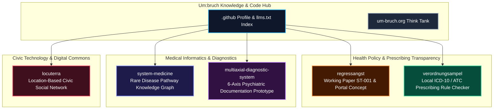

# Um:bruch

<!-- public-index-last-checked: 2026-07-27 -->

<p align="center">
  <a href="https://github.com/um-bruch"></a>
  <a href="https://github.com/open-bricks"></a>
  <a href="https://um-bruch.org"></a>
  <a href="#research-use-boundary"></a>
  <a href="https://github.com/um-bruch/.github/blob/main/llms.txt"></a>
</p>

<h3 align="center">Independent think tank for health-system analysis, statutory prescribing transparency, civic technology, and local-first software prototypes</h3>

<p align="center">
  <b>Language / Sprache:</b> <a href="README.md">English</a> | <a href="README_de.md">Deutsch</a>
</p>

Um:bruch publishes research analyses, position papers, open health-policy data, and practical local-first software prototypes. Our public work bridges statutory prescribing regulations (AM-RL, G-BA, PRISCUS), rare-disease pathway logic, psychiatric documentation models (DSM-5-TR, ICD-11, ICF), and location-based digital commons.

---

## Domain Architecture & Research Pillars



## Start Here

| Objective | Start Repository / Link | Key Focus |
|---|---|---|
| Read research papers & blog publications | [um-bruch.org/projekte](https://um-bruch.org/projekte/) | Official think tank publication index |
| Examine German prescribing recourse anxiety research | [regressangst](https://github.com/um-bruch/regressangst) | Working paper ST-001, health-policy transparency, PP-003 portal concept |
| Test local prescribing rule checking algorithms | [verordnungsampel](https://github.com/um-bruch/verordnungsampel) | Local ICD-10-GM / ATC checks against AM-RL, G-BA, PRISCUS rule sets |
| Explore rare-disease knowledge graphs & 6-axis diagnostic models | [system-medicine](https://github.com/um-bruch/system-medicine) & [multiaxial-diagnostic-system](https://github.com/um-bruch/multiaxial-diagnostic-system) | Pathway exclusion reasoning, DSM-5-TR / ICD-11 / ICF documentation prototype |
| Inspect municipal location-based civic network demonstrator | [locuterra](https://github.com/um-bruch/locuterra) | Next.js demonstrator, PWA companion, municipal digital commons |
| Machine-readable crawler & LLM index | [`llms.txt`](https://github.com/um-bruch/.github/blob/main/llms.txt) | Canonical context, preferred search terms, repository boundaries |

## Public Repository Directory

This public directory intentionally lists public repositories only. All 6 public, active, non-forked repositories were verified against the live `um-bruch` organization on **2026-07-27**.

| Repository | Tech Stack & License | Description |
|---|---|---|
| [regressangst](https://github.com/um-bruch/regressangst) | Markdown, LaTeX, Research Data · CC BY 4.0 | Working paper ST-001 on German statutory prescribing-audit recourse anxiety, health-care system transparency, and the PP-003 Regress portal concept |
| [verordnungsampel](https://github.com/um-bruch/verordnungsampel) | Python 3.10+, PySide6, SQLite, PWA · GPL-3.0 | Research-use software draft for local ICD-10-GM / ATC checks against German statutory prescribing rule sets (AM-RL, G-BA, PRISCUS, Praxisbesonderheiten) |
| [system-medicine](https://github.com/um-bruch/system-medicine) | Python 3.10+, PySide6, SQLite, NetworkX · MIT | Research-only functional pathway medical knowledge graph for rare-disease differential diagnosis, pathway exclusion logic, and biomedical graph reasoning |
| [multiaxial-diagnostic-system](https://github.com/um-bruch/multiaxial-diagnostic-system) | Python 3.10+, Streamlit, Flask, SQLite · MIT | Research-use-only 6-axis psychiatric documentation prototype referencing DSM-5-TR, ICD-11, ICF, HiTOP, Streamlit workspace, and Flask screening testcenter |
| [locuterra](https://github.com/um-bruch/locuterra) | TypeScript, React, Next.js, PWA, TailwindCSS · MIT | Open-source concept and Next.js demonstrator for a public-interest, location-based civic social network and digital commons for municipalities |
| [`.github`](https://github.com/um-bruch/.github) | Markdown, GFM, `llms.txt` | Organization landing page, repository directory, community guidelines, and machine-readable `llms.txt` context |

## Public Activity Snapshot

| Repository | Default Branch | Last Public Push | Public Role |
|---|---:|---:|---|
| [system-medicine](https://github.com/um-bruch/system-medicine) | `main` | 2026-07-26 | Active medical informatics prototype |
| [verordnungsampel](https://github.com/um-bruch/verordnungsampel) | `main` | 2026-07-26 | Active prescribing rule checker prototype |
| [regressangst](https://github.com/um-bruch/regressangst) | `master` | 2026-07-26 | Active health-policy research repository |
| [multiaxial-diagnostic-system](https://github.com/um-bruch/multiaxial-diagnostic-system) | `master` | 2026-07-23 | Active psychiatric documentation prototype |
| [locuterra](https://github.com/um-bruch/locuterra) | `master` | 2026-07-23 | Active civic tech demonstrator |
| [`.github`](https://github.com/um-bruch/.github) | `main` | 2026-07-27 | Active organization profile and index |

## Research-Use Boundary

> [!IMPORTANT]
> Medical and diagnostic repositories published by Um:bruch (`system-medicine`, `multiaxial-diagnostic-system`, `verordnungsampel`) are research, analysis, and proof-of-concept software. They do **not** constitute medical advice, clinical guidelines, or certified medical devices under EU MDR / BfArM regulations.

> [!NOTE]
> For machine-assisted discovery and LLM context extraction, see [`llms.txt`](https://github.com/um-bruch/.github/blob/main/llms.txt).

## Working Principles

| Principle | Meaning |
|---|---|
| **Reproducible & Inspectable** | Research sources, dataset transformations, and code logic are fully open for audit. |
| **Research vs. Clinical Claims** | Software prototypes serve exploratory analysis and health-policy debate, not patient care. |
| **Local-First & Data-Parsimonious** | Applications run locally on user hardware without mandatory cloud telemetry or data leakage. |
| **Bilingual Connection** | Primary research context is German health policy; English metadata enables international discovery. |

## Search Phrases

```
Um:bruch Think Tank GitHub
Um:bruch re:shape health policy software
Umbruch Regressangst VerordnungsAmpel
VerordnungsAmpel ICD-10 ATC AM-RL PRISCUS
prescribing audit recourse anxiety Germany
Umbruch local-first civic tech
um-bruch system medicine knowledge graph
functional pathway medical knowledge graph rare disease
um-bruch multiaxial diagnostic system
DSM-5-TR ICD-11 ICF documentation prototype
public-interest location based civic tech Next.js
um-bruch open-source Forschungssoftware
um-bruch public-interest health policy research
```

## Ecosystem & Sister Organizations

Um:bruch collaborates within a broader network of local-first software and research initiatives:

| Organization | Focus Area |
|---|---|
| [open-bricks](https://github.com/open-bricks) | Dachorganisation / Umbrella org for local-first desktop tools & research software |
| [research-line](https://github.com/research-line) | Scientific research, mathematical proofs, and open-science preprints |
| [ellmos-ai](https://github.com/ellmos-ai) | AI infrastructure, MCP servers, agent memory, and orchestration engines |
| [file-bricks](https://github.com/file-bricks) | PySide6 desktop file management, privacy guardians, and indexing tools |
| [doc-bricks](https://github.com/doc-bricks) | Document processing, markdown utilities, OCR, and document readers |
| [dev-bricks](https://github.com/dev-bricks) | Developer tools, test environments, and CLI utilities |
| [biotec-line](https://github.com/biotec-line) | Bioinformatics, VCF pipelines, and genetic data processing |
| [entertain-and-more](https://github.com/entertain-and-more) | Terminal games, audio tools, and entertainment software |
| [assistassets-ai](https://github.com/assistassets-ai) | Finance pattern exploration & Streamlit evidence review tools |
| [lukisch](https://github.com/lukisch) | Personal GitHub developer profile |

## Contact & Imprint

- Website: [um-bruch.org](https://um-bruch.org)
- Imprint: [um-bruch.org/impressum](https://um-bruch.org/impressum/)

<!-- last-checked: 2026-07-27 -->
