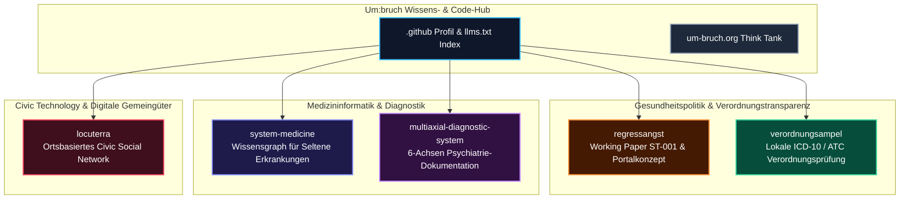

# Um:bruch

<!-- public-index-last-checked: 2026-08-13 -->

<p align="center">
  <a href="https://github.com/um-bruch"></a>
  <a href="https://github.com/open-bricks"></a>
  <a href="https://um-bruch.org"></a>
  <a href="#forschungsvorbehalt--nutzungsgrenzen"></a>
  <a href="https://github.com/um-bruch/.github/blob/main/llms.txt"></a>
</p>

<h3 align="center">Unabhängiger Think Tank für Gesundheitssystem-Analysen, Verordnungstransparenz, Civic Tech und gemeinwohlorientierte Software-Prototypen</h3>

<p align="center">
  <b>Sprache / Language:</b> <a href="README_de.md">Deutsch</a> | <a href="README.md">English</a>
</p>

Um:bruch veröffentlicht Forschungsanalysen, Positionspapiere, offene Daten zur Gesundheitspolitik und praktische local-first Software-Prototypen. Unsere Arbeit schlägt die Brücke zwischen Verordnungsregeln im deutschen Gesundheitswesen (AM-RL, G-BA, PRISCUS), Pfadlogik bei Seltenen Erkrankungen, psychiatrischen Dokumentationsmodellen (DSM-5-TR, ICD-11, ICF) und ortsbasierten digitalen Gemeingütern.

---

## Domain-Architektur & Forschungssäulen



## Einstieg

| Ziel | Startpunkt / Link | Schwerpunkt |
|---|---|---|
| Forschungsberichte & Veröffentlichungen lesen | [um-bruch.org/projekte](https://um-bruch.org/projekte/) | Offizieller Publikationsindex des Think Tanks |
| Studien zu Regressangst & Verordnungsregressen prüfen | [regressangst](https://github.com/um-bruch/regressangst) | Working Paper ST-001, Gesundheitspolitik-Transparenz, PP-003 Portalkonzept |
| Lokale Verordnungsprüfungen testen | [verordnungsampel](https://github.com/um-bruch/verordnungsampel) | Lokale ICD-10-GM / ATC Prüfungen gegen AM-RL, G-BA, PRISCUS Regelwerke |
| Wissensgraphen & 6-Achsen-Diagnostik erkunden | [system-medicine](https://github.com/um-bruch/system-medicine) & [multiaxial-diagnostic-system](https://github.com/um-bruch/multiaxial-diagnostic-system) | Ausschlusslogik bei Seltenen Erkrankungen, DSM-5-TR / ICD-11 / ICF Prototyp |
| Kommunalen Civic-Tech-Demonstrator testen | [locuterra](https://github.com/um-bruch/locuterra) | Next.js Demonstrator, PWA Companion, digitale Gemeingüter für Kommunen |
| Maschinenlesbarer Crawler- & LLM-Index | [`llms.txt`](https://github.com/um-bruch/.github/blob/main/llms.txt) | Kanonischer Kontext, Suchbegriffe, Repository-Grenzen |

## Öffentliches Repository-Verzeichnis

Dieses Verzeichnis listet bewusst nur öffentliche Repositories. Alle 6 öffentlichen, aktiven, nicht geforkten Repositories wurden am **13.08.2026** gegen die Live-Organisation `um-bruch` verifiziert.

| Repository | Tech-Stack & Lizenz | Beschreibung |
|---|---|---|
| [regressangst](https://github.com/um-bruch/regressangst) | Markdown, LaTeX, Research Data · CC BY 4.0 | Working Paper ST-001 zu Regressangst, Verordnungsregressen, Transparenz im Gesundheitswesen und dem PP-003 Regressportal-Konzept |
| [verordnungsampel](https://github.com/um-bruch/verordnungsampel) | Python 3.10+, PySide6, SQLite, PWA · GPL-3.0 | Research-use Softwareentwurf für lokale ICD-10-GM / ATC Prüfungen gegen deutsche Verordnungsregelwerke (AM-RL, G-BA, PRISCUS, Praxisbesonderheiten) |
| [system-medicine](https://github.com/um-bruch/system-medicine) | Python 3.10+, PySide6, SQLite, NetworkX · MIT | Forschungsprototyp für funktionale medizinische Wissensgraphen, Differentialdiagnostik bei Seltenen Erkrankungen und Ausschlusslogik |
| [multiaxial-diagnostic-system](https://github.com/um-bruch/multiaxial-diagnostic-system) | TeX, Python 3.10+, Streamlit, Flask, SQLite · MIT | 6-Achsen-Dokumentationsprototyp mit DSM-5-TR, ICD-11, ICF, HiTOP, Streamlit-Oberfläche und Flask-Screening-Testcenter (kein Medizinprodukt) |
| [locuterra](https://github.com/um-bruch/locuterra) | TypeScript, React, Next.js, PWA, TailwindCSS · MIT | Open-Source-Konzept und Next.js-Demonstrator für ein gemeinwohlorientiertes, ortsbasiertes soziales Netzwerk für Kommunen |
| [`.github`](https://github.com/um-bruch/.github) | Markdown, GFM, `llms.txt` | Organisationsprofil, Repository-Verzeichnis, Community-Richtlinien und maschinenlesbarer `llms.txt`-Kontext |

## Öffentlicher Aktivitäts-Snapshot

| Repository | Default-Branch | Letzter Push | Öffentliche Rolle |
|---|---:|---:|---|
| [system-medicine](https://github.com/um-bruch/system-medicine) | `main` | 05.08.2026 | Aktiver Medizininformatik-Prototyp |
| [multiaxial-diagnostic-system](https://github.com/um-bruch/multiaxial-diagnostic-system) | `master` | 05.08.2026 | Aktiver Psychiatrie-Dokumentationsprototyp |
| [verordnungsampel](https://github.com/um-bruch/verordnungsampel) | `main` | 05.08.2026 | Aktiver Verordnungsprüfer-Prototyp |
| [regressangst](https://github.com/um-bruch/regressangst) | `master` | 27.07.2026 | Aktives gesundheitspolitisches Forschungs-Repo |
| [locuterra](https://github.com/um-bruch/locuterra) | `master` | 23.07.2026 | Aktiver Civic-Tech-Demonstrator |
| [`.github`](https://github.com/um-bruch/.github) | `main` | 13.08.2026 | Aktives Organisationsprofil & Index |

## Forschungsvorbehalt & Nutzungsgrenzen

> [!IMPORTANT]
> Die von Um:bruch veröffentlichten medizinischen und diagnostischen Repositories (`system-medicine`, `multiaxial-diagnostic-system`, `verordnungsampel`) sind Forschungs-, Analyse- und Konzeptsoftware. Sie ersetzen **keine** ärztliche Beratung, keine Leitlinien und keine regulatorisch zugelassene Medizinsoftware im Sinne der EU-MDR / BfArM-Vorgaben.

> [!NOTE]
> Für die automatische Kontextverarbeitung durch LLMs und Such-Crawler siehe [`llms.txt`](https://github.com/um-bruch/.github/blob/main/llms.txt).

## Arbeitsprinzipien

| Prinzip | Bedeutung |
|---|---|
| **Offen & Prüfbar** | Quellen, Datentransformationen und Code-Logik sind vollständig offen zur wissenschaftlichen Überprüfung. |
| **Forschung statt Heilsversprechen** | Prototypen sind Werkzeuge zur Analyse und Fachdiskussion, keine Medizinprodukte für den Versorgungseinsatz. |
| **Local-First & Datensparsam** | Anwendungen laufen lokal auf eigener Hardware ohne erzwungene Cloud-Telemetrie oder Datenabfluss. |
| **Mehrsprachig vernetzt** | Primärer Kontext ist das deutsche Gesundheitssystem; englische Metadaten sichern die internationale Sichtbarkeit. |

## Suchkontext

```
Um:bruch Think Tank GitHub
Um:bruch health policy research software
Um:bruch re:shape health policy software
Umbruch Regressangst VerordnungsAmpel
VerordnungsAmpel ICD-10 ATC AM-RL PRISCUS
prescribing audit recourse anxiety Germany
Umbruch local-first civic tech
um-bruch system medicine knowledge graph
functional pathway medical knowledge graph rare disease
German prescribing transparency research
um-bruch multiaxial diagnostic system
DSM-5-TR ICD-11 ICF documentation prototype
public-interest location based civic tech Next.js
um-bruch open-source Forschungssoftware
um-bruch public-interest health policy research
```

## Ökosystem & Netzwerk

Um:bruch arbeitet im Verbund mit einem Netz aus Open-Science- und Local-First-Software-Initiativen:

| Organisation | Schwerpunkt |
|---|---|
| [open-bricks](https://github.com/open-bricks) | Dachorganisation für local-first Desktop-Tools & Forschungssoftware |
| [research-line](https://github.com/research-line) | Wissenschaftliche Forschung, mathematische Beweise & Open-Science-Preprints |
| [ellmos-ai](https://github.com/ellmos-ai) | KI-Infrastruktur, MCP-Server, Agentengedächtnis & Routing-Systeme |
| [file-bricks](https://github.com/file-bricks) | PySide6 Desktop-Dateiverwaltung, Datenschutzwächter & Indexierungs-Tools |
| [doc-bricks](https://github.com/doc-bricks) | Dokumentenverarbeitung, Markdown-Tools, OCR & Dokumenten-Reader |
| [dev-bricks](https://github.com/dev-bricks) | Entwicklerwerkzeuge, Testumgebungen & CLI-Utilities |
| [biotec-line](https://github.com/biotec-line) | Bioinformatik, VCF-Pipelines & Genetik-Werkzeuge |
| [entertain-and-more](https://github.com/entertain-and-more) | Terminal-Spiele, Audio-Tools & Entertainment-Software |
| [assistassets-ai](https://github.com/assistassets-ai) | Finanzmuster-Exploration & Streamlit Review-Tools |
| [lukisch](https://github.com/lukisch) | Persönliches GitHub-Entwicklerprofil |

## Kontakt & Impressum

- Website: [um-bruch.org](https://um-bruch.org)
- Impressum: [um-bruch.org/impressum](https://um-bruch.org/impressum/)

<!-- last-checked: 2026-08-13 -->
