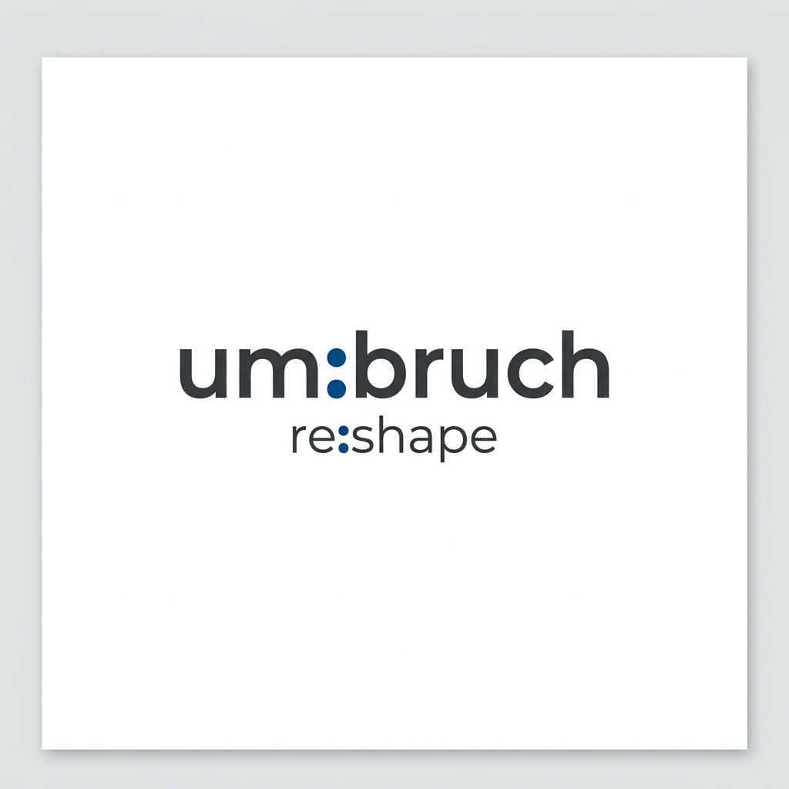
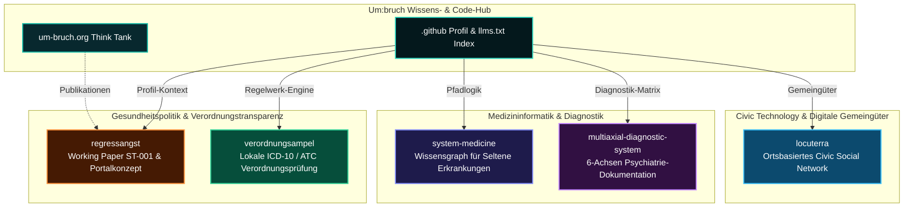

<p align="center">
  <a href="https://github.com/um-bruch"></a>
</p>

<p align="center">
  <a href="https://github.com/um-bruch/.github/blob/main/profile/README_de.md"></a>
  <a href="https://github.com/open-bricks"></a>
  <a href="https://um-bruch.org"></a>
  <a href="https://github.com/um-bruch"></a>
  <a href="https://github.com/um-bruch"></a>
  <a href="#forschungsvorbehalt--nutzungsgrenzen"></a>
  <a href="https://github.com/um-bruch"></a>
  <a href="https://github.com/um-bruch/.github/blob/main/llms.txt"></a>
  <a href="https://github.com/um-bruch/.github/blob/main/profile/README.md"></a>
</p>

# Um:bruch

<!-- public-index-last-checked: 2026-09-23 -->

[🇩🇪 Deutsche Version](README_de.md) | [🇬🇧 English](README.md)

**Unabhängiger Think Tank und Entwicklungslabor für Gesundheitssystem-Analysen, Verordnungstransparenz, Pfadlogik bei Seltenen Erkrankungen und gemeinwohlorientierte Civic Technology.**

Um:bruch veröffentlicht wissenschaftlich nachprüfbare Forschungsanalysen, offene gesundheitspolitische Daten, Positionspapiere und praktische local-first Software-Prototypen. Unsere Arbeit schlägt die Brücke zwischen Verordnungsregelwerken im deutschen Gesundheitssystem (AM-RL, G-BA, PRISCUS 2.0, Praxisbesonderheiten), medizinischen Wissensgraphen für Seltene Erkrankungen, multiaxialen psychiatrischen Dokumentationsmodellen (DSM-5-TR, ICD-11, ICF) und ortsbasierten digitalen Gemeingütern für Kommunen.

> [!NOTE]
> **Öffentlicher Navigationsindex:** Aktualisiert und verifiziert gegen die Live-GitHub-API am **23. September 2026**. Alle 6 in `um-bruch` aktiven öffentlichen Repositories (5 Forschungs-/Civic-Projekte plus 1 zentrales Profil-Repository) sind hier vollständig erfasst.

> [!TIP]
> **Local-First & Datensparsam:** Sämtliche Software-Prototypen von Um:bruch arbeiten lokal auf dem Rechner der Anwendenden ohne erzwungene Cloud-Dienste, Telemetrie oder Benutzer-Tracking. Datenschutz und offene, nachvollziehbare Forschung sind unverrückbare Grundprinzipien.

---

## Tool-Vitrine

<p align="center">
  <a href="https://github.com/um-bruch/verordnungsampel"></a>
  <a href="https://github.com/um-bruch/locuterra"></a>
</p>

*Oben: [VerordnungsAmpel](https://github.com/um-bruch/verordnungsampel) (Lokale Verordnungsprüfung & Heilmittelbudget-Führung) und [LOCUTERRA](https://github.com/um-bruch/locuterra) (Gemeinwohlorientierter ortsbasierter Civic-Tech-Demonstrator).*

---

## Einstieg

| Vorhaben / Bedarf | Repository / Einstiegspunkt | Schwerpunkt & Kernfunktionen |
|---|---|---|
| Deutsche Verordnungsregeln & Heilmittelbudgets prüfen | [verordnungsampel](https://github.com/um-bruch/verordnungsampel) | Lokale ICD-10-GM / ATC Prüfungen gegen AM-RL, G-BA, PRISCUS 2.0 und Heilmittelkatalog |
| Regressangst & Prüfungsrisiken im Gesundheitssystem analysieren | [regressangst](https://github.com/um-bruch/regressangst) | Working Paper ST-001, gesundheitspolitische Transparenz & PP-003 Regressportal-Konzept |
| Wissensgraphen & Ausschlusslogik bei Seltenen Erkrankungen | [system-medicine](https://github.com/um-bruch/system-medicine) | Medizinischer Wissensgraph, funktionale Pfadlogik, Ausschlussregeln & PySide6-Workspace |
| 6-Achsen-Dokumentationsprototypen in der Psychiatrie erkunden | [multiaxial-diagnostic-system](https://github.com/um-bruch/multiaxial-diagnostic-system) | Dokumentationsmodell mit DSM-5-TR, ICD-11, ICF, HiTOP, Streamlit-Workspace & Flask-Testcenter |
| Kommunales ortsbasiertes Civic Social Network testen | [locuterra](https://github.com/um-bruch/locuterra) | Open-Source-Konzept, Next.js-Demonstrator, PWA-Begleiter & digitale Gemeingüter |
| Maschinenlesbarer Crawler-, Agenten- & LLM-Index | [`llms.txt`](https://github.com/um-bruch/.github/blob/main/llms.txt) | Kanonischer Kontext, Suchbegriffe, Repositorium-Grenzen & Positionierung |

---

## Domain-Architektur & Forschungssäulen



---

## Öffentliches Repository-Verzeichnis

Verifiziert gegen die Live-GitHub-API am **23.09.2026**: 6 öffentliche Repositories insgesamt (5 Forschungs- & Software-Projekte plus 1 zentrales Organisationsprofil).

| Repository | Tech-Stack & Lizenz | Beschreibung & Besonderheiten | Suchbegriffe | Letzter Public Push |
|---|---|---|---|---|
| [verordnungsampel](https://github.com/um-bruch/verordnungsampel) | Python 3.10+, PySide6, SQLite, PWA · GPL-3.0 | Local-First Verordnungs- und Budget-Ampelsystem für das deutsche Gesundheitswesen. Gleicht ICD-10-GM / ATC Paare gegen AM-RL, G-BA Beschlüsse, PRISCUS 2.0 und Heilmittelbudgets ab. | `VerordnungsAmpel`, `AM-RL`, `G-BA`, `PRISCUS 2.0`, `Heilmittelkatalog`, `ICD-10-GM ATC Prüfung`, `Verordnungsregress`, `Praxisbesonderheiten` | **20.09.2026** |
| [locuterra](https://github.com/um-bruch/locuterra) | TypeScript, React, Next.js, TailwindCSS, PWA · MIT | Open-Source-Konzept und interaktiver Next.js-Demonstrator für ein gemeinwohlorientiertes, ortsbasiertes soziales Netzwerk und digitale Gemeingüter für Kommunen mit synthetischen Grüntal-Modelldaten. | `LOCUTERRA`, `Civic Tech`, `digitale Gemeingüter`, `ortsbasiertes Netzwerk`, `Next.js PWA`, `Kommunalsoftware`, `Bürgerbeteiligung` | **25.08.2026** |
| [system-medicine](https://github.com/um-bruch/system-medicine) | Python 3.10+, PySide6, SQLite, NetworkX · MIT | Forschungsprototyp für funktionale biomedizinische Wissensgraphen, Differentialdiagnostik bei Seltenen Erkrankungen und Ausschlusslogik. Dauerhafter DOI: [10.5281/zenodo.20101507](https://doi.org/10.5281/zenodo.20101507). | `Systemmedizin`, `biomedizinischer Wissensgraph`, `Seltene Erkrankungen Differentialdiagnose`, `Ausschlusslogik`, `Graphentheorie Medizin` | **21.08.2026** |
| [multiaxial-diagnostic-system](https://github.com/um-bruch/multiaxial-diagnostic-system) | TeX, Python 3.10+, Streamlit, Flask, SQLite · MIT | 6-Achsen-Dokumentationsprototyp (Forschungssoftware) mit DSM-5-TR, ICD-11, ICF, HiTOP, Streamlit-Arbeitsbereich und Flask-Screening-Testcenter. Dauerhafter DOI: [10.5281/zenodo.18736725](https://doi.org/10.5281/zenodo.18736725). | `multiaxiale Diagnostik`, `DSM-5-TR ICD-11 ICF`, `Psychiatrie Dokumentation Prototyp`, `HiTOP dimensionale Diagnostik`, `Streamlit Medizininformatik` | **05.08.2026** |
| [regressangst](https://github.com/um-bruch/regressangst) | Markdown, LaTeX, Research Data · CC BY 4.0 | Working Paper ST-001 zu Regressangst im deutschen Gesundheitswesen, Verordnungsregressen, Transparenzdefiziten und dem PP-003 Regressportal-Konzept. | `Regressangst`, `Verordnungsregress`, `Wirtschaftlichkeitsprüfung`, `Gesundheitspolitik Transparenz`, `Arzneimittelregress`, `Kassenarzt` | **27.07.2026** |
| [`.github`](https://github.com/um-bruch/.github) | Markdown, GFM, YAML, `llms.txt`, pytest | Zentrales Organisationsprofil, Community-Dateien, Contract-Testsuite, llms.txt Kontext und Ökosystem-Auffindbarkeitsindex. | `um-bruch`, `Organisationsprofil`, `llms.txt`, `Repository-Verzeichnis`, `Think Tank Gesundheitspolitik` | **20.09.2026** |

---

## Forschungsvorbehalt & Nutzungsgrenzen

> [!IMPORTANT]
> **Ausschließliche Forschungs- und Konzeptsoftware:**
> Die von Um:bruch veröffentlichten Repositories (`system-medicine`, `multiaxial-diagnostic-system`, `verordnungsampel`) sind wissenschaftliche Prototypen und Diskussionsbeiträge für die gesundheitspolitische Analyse.
> 
> Sie stellen **keine** ärztliche Beratung, keine Behandlungsleitlinien, keine diagnostische Freigabe und keine zugelassenen Medizinprodukte im Sinne der EU-Medizinprodukte-Verordnung (EU MDR 2017/745) oder des deutschen Medizinprodukterechts dar. Medizinische Entscheidungen obliegen ausschließlich approbierten Ärztinnen, Ärzten und Therapeuten.

---

## Arbeitsprinzipien

| Prinzip | Technische & ethische Bedeutung |
|---|---|
| **Offen & Nachprüfbar** | Quellen, Berechnungslogik, Datenmodelle und Transformationsschritte sind zur wissenschaftlichen Überprüfung und zum Peer-Review vollständig offengelegt. |
| **Forschung statt Heilsversprechen** | Prototypen sind Werkzeuge zur Analyse und Fachdiskussion, keine Medizinprodukte für den klinischen Versorgungseinsatz. |
| **Local-First & Datensparsam** | Anwendungen laufen lokal auf eigener Hardware ohne erzwungene Cloud-Telemetrie oder Datenabfluss. |
| **Mehrsprachig vernetzt** | Primärer Kontext ist das deutsche Gesundheitssystem; englische Metadaten sichern die internationale wissenschaftliche Sichtbarkeit. |

---

## Suchkontext & Auffindbarkeit

```
Um:bruch Think Tank GitHub
Um:bruch health policy research software
Um:bruch re:shape health policy software
Umbruch Regressangst VerordnungsAmpel
VerordnungsAmpel ICD-10 ATC AM-RL PRISCUS
prescribing audit recourse anxiety Germany
Umbruch local-first civic tech
um-bruch system medicine knowledge graph
functional pathway medical knowledge graph rare disease
rare disease differential diagnosis knowledge graph
German healthcare research software local-first
German prescribing transparency research
um-bruch multiaxial diagnostic system
DSM-5-TR ICD-11 ICF documentation prototype
public-interest location based civic tech Next.js
LOCUTERRA municipal digital commons PWA
um-bruch open-source Forschungssoftware
um-bruch public-interest health policy research
um-bruch github organization profile llms.txt
```

---

## Ökosystem & Verbundorganisationen

Um:bruch arbeitet im Verbund mit einem Netzwerk aus Open-Science-Initiativen, Desktop-Werkzeugen und Entwicklerinfrastruktur:

| Organisation | Themenschwerpunkt | Wichtige Repositories & Rolle |
|---|---|---|
| [open-bricks](https://github.com/open-bricks) | Dachorganisation / Software Suite | Zentraler Katalog & Dach für quelloffene Desktop-Software |
| [ellmos-ai](https://github.com/ellmos-ai) | KI-Agenteninfrastruktur | `bach`, `rinnsal`, `MarbleRun`, `skills`, `n8n-workflow-manager` |
| [file-bricks](https://github.com/file-bricks) | Desktop-Dateiverwaltung | `ProFiler`, `ExplorerPro`, `ProSync`, `AmpelClip`, `ProfiPrompt` |
| [doc-bricks](https://github.com/doc-bricks) | Dokumenten- & Mediensysteme | `DokuReader`, `MediaBrain`, `UniversalInvoiceMail`, `CleanMarkdown` |
| [dev-bricks](https://github.com/dev-bricks) | Entwicklerwerkzeuge | `DevCenter`, `CodeBox`, `pythonbox`, `app-rotator`, `apiprober` |
| [research-line](https://github.com/research-line) | Open Science & Mathematische Physik | `crm-cosmology`, `fst-nash`, `epstein-network`, `rh-even-dominance` |
| [biotec-line](https://github.com/biotec-line) | Bioinformatik & Genetik | `VFDistiller`, `genotype-to-vcf` |
| [assistassets-ai](https://github.com/assistassets-ai) | Lokale Finanzdaten-Analyse | `FinancialProof`, `DEV_FullAssistantHub_SUITE` |
| [entertain-and-more](https://github.com/entertain-and-more) | Spiele, RPG & Medienwerkzeuge | `ChatAndChess`, `rpx`, `KlangpultLight` |
| [um-bruch](https://github.com/um-bruch) | Gesundheitspolitik & Civic Tech | `verordnungsampel`, `locuterra`, `system-medicine`, `regressangst` |
| [lukisch](https://github.com/lukisch) | Entwicklerprofil | Zentrales Entwicklerportal & Flaggschiff-Projekte |

---

## Kontakt & Impressum

- **Think-Tank Webseite:** [um-bruch.org](https://um-bruch.org)
- **Projekte & Publikationen:** [um-bruch.org/projekte](https://um-bruch.org/projekte/)
- **Impressum & Kontakt:** [um-bruch.org/impressum](https://um-bruch.org/impressum/)
- **Dauerhafte Zenodo-DOIs:** [system-medicine (10.5281/zenodo.20101507)](https://doi.org/10.5281/zenodo.20101507) | [multiaxial-diagnostic-system (10.5281/zenodo.18736725)](https://doi.org/10.5281/zenodo.18736725)

<!-- last-checked: 2026-09-23 -->
